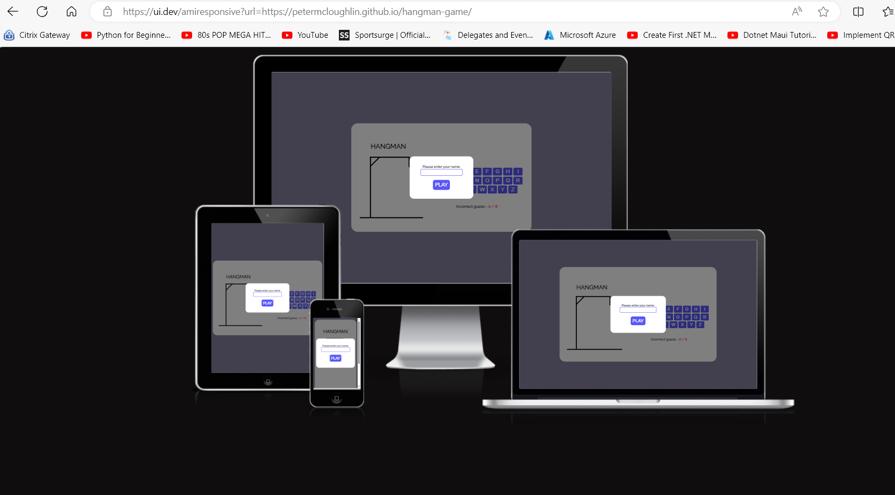
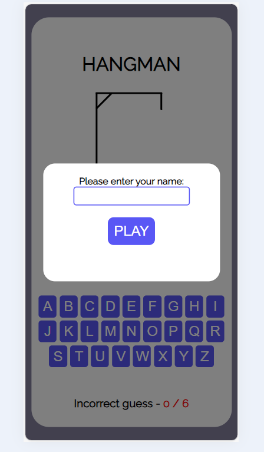
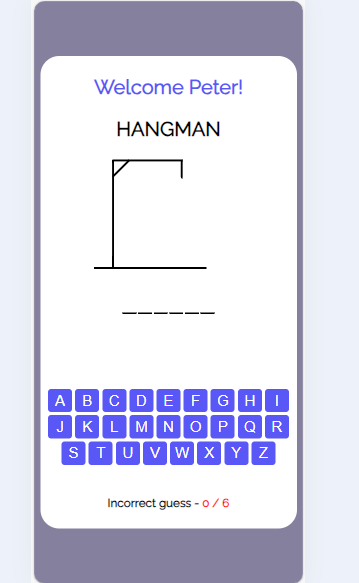
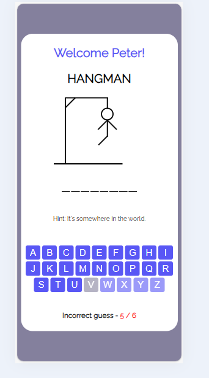
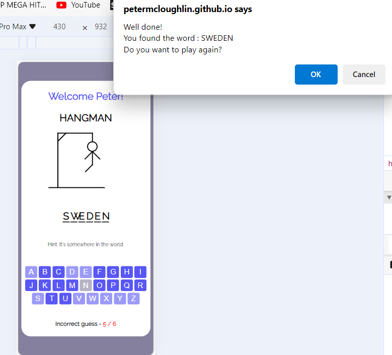
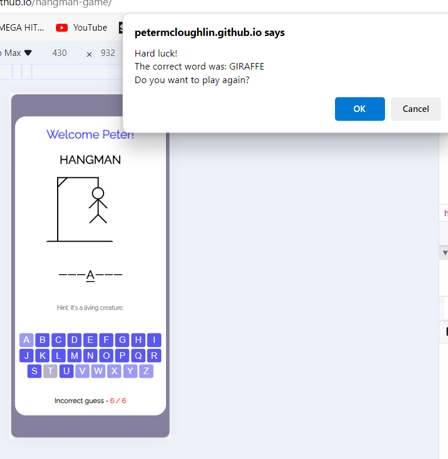

Hangman Game

This is a simple game of Hangman for use for any age group above 10 years of age. Its a one page interactive web application built using html, css and vanilla javascript. The purpose of the application is to allow users play the game of Hangman. The game itself introduced with a modal pop up prompting the user to input their name before clicking the Play button.You can access the deployed application using the link below;

[Hangman-game](https://petermcloughlin.github.io/hangman-game/) 

* Contents
    * Features
    * User Experience / User Interface
    * Testing
    * Deployment
    * Bugs / Fixes
    * Credits

## Features
The Hangman web application is comprised of one webpage:
* index.html
    * This is landing page in which the the welcome-modal greets the user when initialising the game, prompting the user to input their name.
    * Once the user inputs their name, the game begins, where a random word has been chosen by the application from an array and the user users the keyboard buttons to guess what the word is.
    * If the user makes more than 4 incorrect guesses, a Hint will display below the word letter spaces to assist the user.
    * If the user guesses the word correctly, a confirm pop-up will display congratulating the user, displaying the word they guessed correctly and asking the user if they would like to play again.
    * If the user guesses the word incorrectly, a confirm pop-up will display 'Hard luck!' to the user, displaying the correct word and asking the user if they would like to play again.
    * If the user wishes to play again, the user's name will remain at the top of the web page and the game refreshes with a new random word to guess from.
    * If the user does not wish to play again, the page will remain as it and the user can just exit the webpage.
    * A hard refresh of the web page will restart the game completely, prompting the user with the welcome modal.

### Features 
The index.html page contains div elements containing the hangman welcome modal, game title, hangman game image section, random word display, hint section, keyboard section and incorrect guess count section.

* Welcome Modal
 Here, the user is prompted to input their name before starting the game.

* Game Start

* Hint Display ( after the user makes 4 incorrect guesses )

* Success 

* Failure

## User Experience / User Interface

When designing the web application at the planning stage, I opted to go for a word game that anyone could play.
I kept it simple with a simple word list broken into four categories - Countries, Food, Transport, Animals

The objective was to keep things simple, while ensuring the page gives enough interaction and feedback the user when necessary. I opeted to display the hint after 4 incorrect guesses as a little assist to the user while playing the game.

The colour selection of #5957F5, black for the foreground text and images, #ffffff for background , along with the opacity  effect on the clicked buttons worked well.

### User Story
As a visitor, the user of the application;
* will want to play a simple word game through simple interaction with the page via keyboard buttons and pop ups.
* will be greeted with a welcome modal in which the user can input their name, which will remain in the page should they wish to keep replaying.
* will be able to avail of a hint which will display after 4 incorrect guesses to assist them.
* will be able to decide whether or not to keep playing via a pop up javascript confirm message at the end of each game.

### Wireframes
At the initial stage of planning, I created some mobile-first approach wireframes to demonstrate a visual display of the user interface - comprising of one web page contain div elements for each appropriate section;
* Welcome Modal
* User name
* Hangman game title
* Hangman game images
* Word Display
* Hint section
* Keyboard section

## Testing
The testing of the application was ongoing throughout the development stages, including the use of element inspection for addition of new elements to the app before committing to GitHub. Testing of the application included the following approaches;

* Manual Testing
* HTML Validation
* CSS Validation
* Javscript Validation
* Responsiveness

### Manual Testing
As a manual test of the web application, I accessed the deployed url on a variety of devices such as iPhone, Android mobile, Tablet, iPad, laptop and Desktop to view the sites visual responsiveness.

* Welcome modal - displayed as expected, accepted input and was hidden on Play button click.
* Username displayed correctly at the top of the page on user input through the welcome modal.
* The hangman images displayed  dynamically on incorrect guesss count increment, as expected.
* The random word letters display in their correct array indexes as expected.
* The incorrect guess count displayed correctly after each increment.
* The hint message displayed correctly after the count of 4 incorrect guesses by the user.
* The Success pop up displayed with the correct message, whilst giving the user the opportunity to replay.
* The Failure pop up displayed with the correct message, whilst giving the user the opportunity to replay.

### HTML, CSS & Javascript Validation
I used [validator.w3.org](https://validator.w3.org/) to validate the html page and [jigsaw](https://jigsaw.w3.org/css-validator/) to validate the css stlyes in the website. I also used [jshint.com](https://jshint.com/) to test the javascript file.

* Testing Results

    * [HTML](readme_images/HTMLValidation.PNG)
    * [CSS](readme_images/CSSValidation.PNG)
    * [Javascript](readme_images/JavascriptValidation.PNG)

### Lighthouse Inspection
The Lighthouse inspection results returned good results for Accessibilty , Best Practices and SEO. 

The Lighthouse Inspection reports can be accessed below;
* Mobile Inspection
    * [HomePage](readme_images/LighthouseMobile.PNG)
    

* Desktop Inspection
    * [HomePage](readme_images/LighthouseDesktop.PNG)

### Responsiveness
The application appeared to be responsive on mobile, tablet, laptop and desktops with sizes adjusting to fit the screen widths for each device type. I used the [Am-I-Responsive](https://ui.dev/amiresponsive) website to test the responsiveness of the applicaton on various devices as a further test.

## Deployment
I used GitHub pages for deployment of the web project at an early stage of the design process. This made it easier to do quick visual tests on each commit that was made from my GitPod workspace. I followed the steps below when deploying the web application project to GitHub;

* I navigated to the Settings option in GitHub
* I selected the main branch and root folder under the Build and Deployment section
* Once saved, the deployment process ran and the saved link appeared.

Here is a link to the live website , [hangman-skywatcgame](https://petermcloughlin.github.io/hangman-game/)

## Bugs / Fixes
During the development process, I fixed any bugs or issues as I encountered them, using incremental steps of code addition whilst constantly checking the live output in GitPod, prior to committing to GitHub.

Overall, I did not encounter any major bugs. However, I did have an issue with the letter display when larger words ( > 11 characters ) were randomly selected. It caused margin and padding issues at first but after meeting with my mentor I opted to reduce the pixel size and gap widths to handle these.

## Credits
The following are credits for the sources of code, imagery and font sourced for the project build;

*   The hangman images were taken from [coding-nepal](https://www.codingnepalweb.com/) as a useful way to pre-prepared .svg hangman images which I could loop through dynamically in the javascript file, as opposed to programmatically drawing the images - I felt that was probaly a step too far for me at this stage.

*   The font for the index.html page was sourced from [Font Awesome](https://fontawesome.com/)

## Summary
In summary, I would like to again thank my mentor Alan for his wise and  useful hints and tips for the future and for some useful links and tools to improve the design process regarding UI/UX. I had trouble trying to amend the welcome modal to re-use it for the success and failure messages at the end of the game, however upon reflection, it came down to a missing 'show' and 'hidden' css class that I was trying to refer to in the code initially. Upon relfection, and after some manual testing with family and friends, I decided to keep the javascript confirm pop up messages as the content was received well by the users who tested for me. 